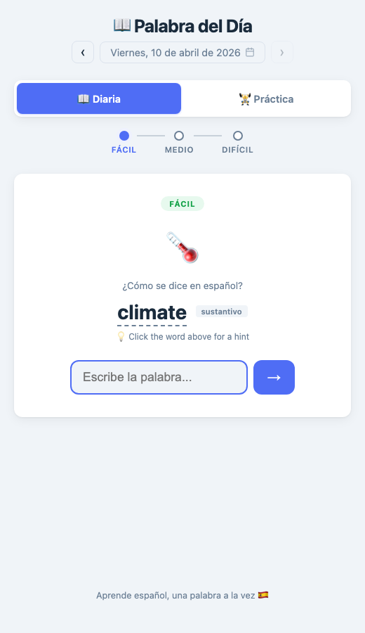
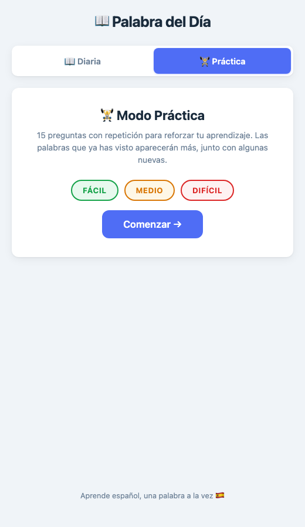
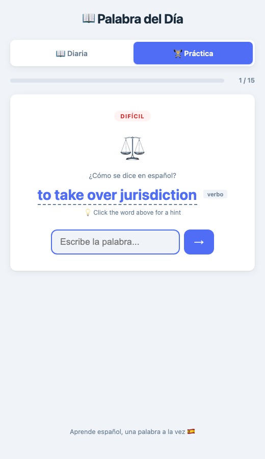

# 📖 Palabra del Día

A simple, daily Spanish vocabulary game. Learn one easy, one medium, and one rare Spanish word each day.

**[Try it live →](https://palabradeldia.onrender.com)** *(update with your deployment URL)*

## Features

- **3 words daily** — one beginner, one intermediate, one advanced, chosen deterministically by date
- **Practice mode** — 15-question sessions with spaced repetition: 7 unique words repeated for reinforcement, favouring words you've already seen
- **Difficulty toggles** — practice with any combination of easy, medium, and hard words
- **2,670 curated words** — 869 easy, 913 medium, 888 hard — each with emoji, part of speech, and example sentence
- **Hint system** — click the English word to reveal a letter pattern (e.g., `ma _ _ _ _ sa`)
- **Fuzzy matching** — detects close guesses (1–2 letters off) and encourages you to try again
- **Accent-tolerant** — accepts answers without tildes, but shows the correct accented form
- **Date navigation** — browse past days with ‹/› buttons or a date picker (back to Jan 1, 2026)
- **Streak tracking** — tracks consecutive days completed via `localStorage`
- **Fully static** — no server, no database, just HTML/CSS/JS

## Screenshot

<p align="center">
  
  &nbsp;&nbsp;
  
  &nbsp;&nbsp;
  
</p>

<p align="center"><em>Daily mode · Practice setup · Practice in progress</em></p>

## How It Works

1. Each day, the app picks 3 words (easy → medium → hard) using a seeded shuffle, so everyone gets the same words on the same day and words don't repeat until the entire pool is exhausted.
2. You're shown the English translation and must type the Spanish word.
3. If you're stuck, click the English word for a hint showing the word length with first/last letters revealed.
4. Close guesses get encouraging "almost!" feedback. You can always reveal the answer.
5. After all 3 words, you see a summary with your streak count.

## Word Database

| Difficulty | Count | Examples |
|------------|-------|---------|
| **Fácil** (Easy) | 869 | casa, comer, rojo, grande |
| **Medio** (Medium) | 913 | orgullo, conseguir, sutil, empresa |
| **Difícil** (Hard) | 888 | efímero, acaecer, paradigma, jurisprudencia |

Each entry includes:
- Spanish word (infinitive for verbs)
- English translation
- Part of speech (sustantivo, verbo, adjetivo, etc.)
- Relevant emoji
- Example sentence in Spanish

## Deploy

This is a fully static site — no build step required. Just serve the files:

```bash
# Local development
python3 -m http.server 8080

# Or with Node
npx serve .
```

Deploy to any static hosting:
- **GitHub Pages** — push to `main` and enable Pages in repo settings
- **Netlify / Vercel** — connect your repo, no config needed
- **Any web server** — just copy the files

## Project Structure

```
├── index.html          # Main page
├── style.css           # Styles
├── app.js              # Game logic, fuzzy matching, localStorage
├── words-easy.js       # 869 beginner words
├── words-medium.js     # 913 intermediate words
├── words-hard.js       # 888 advanced/rare words
├── screenshots/        # README images
├── .gitignore
└── README.md
```

## License

MIT
